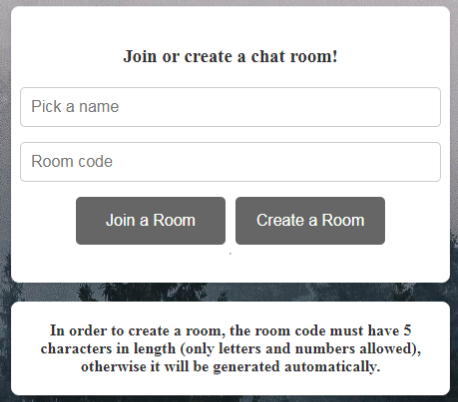
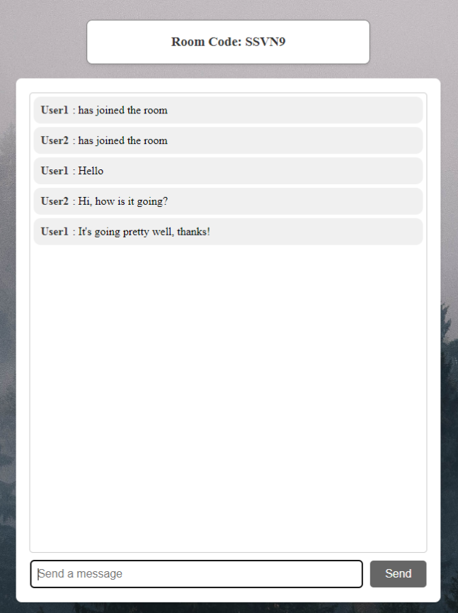

# LiveChat

LiveChat is a real-time chat application built using Flask and Socket.IO. It allows users to create and join chat rooms, send and receive messages instantly, and enjoy a seamless chat experience.

## Features

- Create and join chat rooms.
- Real-time messaging using Socket.IO.
- User-friendly interface.
- Automatic room code generation.
- Instructions and error handling for a smooth user experience.

## Technologies Used

- **Flask:** Python web framework specifically engineered for seamlessly handling the back-end logic of web applications
- **SocketIO:** A library for adding real-time, bidirectional communication between clients and the server, allowing for instant messaging updates.
- **HTML and CSS:** Front-end components are built using HTML for structure and CSS for styling.

## Preview
 

 

